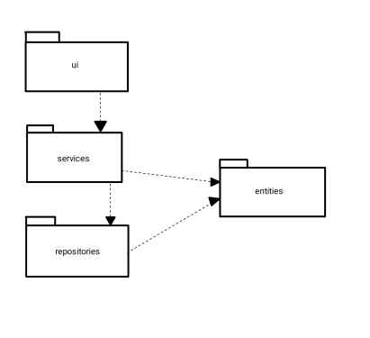
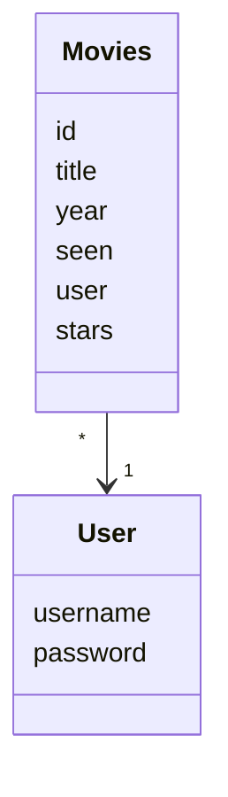
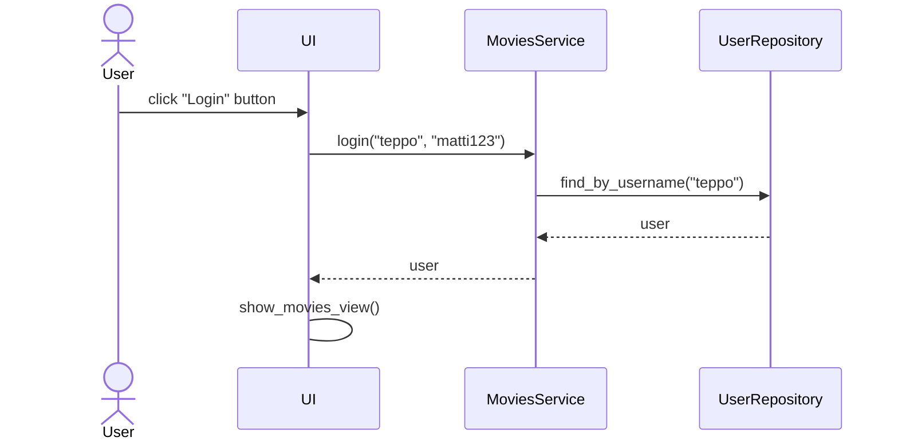

# Arkkitehtuurikuvaus

## Rakenne
Ohjelman rakenne noudattaa kolmitasoista kerrosarkkitehtuuria. Koodin pakkausrakenne on seuraavanlainen:

Pakkaus _ui_ sisältää käyttöliittymästä, _services_ sovelluslogiikasta ja _repositories_ tietojen tallennuksesta vastaavan koodin. Pakkaus _entities_ sisältää luokkia, jotka kuvastavat sovelluksen käyttämiä tietokohteita.

## Sovelluslogiikka
Sovelluksen loogista tietomallia muodostavat luokat [User](https://github.com/onnanna/ot-harjoitustyo/blob/main/src/entities/user.py) ja [Movie](https://github.com/onnanna/ot-harjoitustyo/blob/main/src/entities/movies.py), jotka kuvaavat käyttäjiä ja käyttäjien elokuvia:

Sovelluslogiikan toiminnallisista kokonaisuuksista vastaa luokka [MoviesService](https://github.com/onnanna/ot-harjoitustyo/blob/main/src/services/movies_service.py). Luokassa on käyttöliittymän toiminnoille omat metodit. Metodeja ovat esimerkiksi:
- `login(username, password)`
- `create_movie(title, year, genre, notes)`
- `get_unseen_movies()`
- `set_stars_for_movie(movie_id, stars)`

_MoviesService_ pystyy käsittelemään käyttäjien ja elokuvan tietojen tallennuksesta vastaavan pakkauksessa _repositories_ sijaitsevien luokkien [MoviesRepository](https://github.com/onnanna/ot-harjoitustyo/blob/main/src/repositories/movies_repository.py) ja [UserRepository](https://github.com/onnanna/ot-harjoitustyo/blob/main/src/repositories/user_repository.py) kautta.

`MoviesService`-luokan ja ohjelman muiden osien suhdetta kuvaava luokka/pakkauskaavio:

## Toiminnallisuudet
### Käyttäjän kirjautuminen sisään
Kun kirjautumisnäkymään syötekenttiin kirjoitetaan olemassa olevat käyttäjätunnus ja salasana, jonka jälkeen klikataan painiketta _Login_ sovelluksen kontrolli etenee seuraavanlaisesti:

