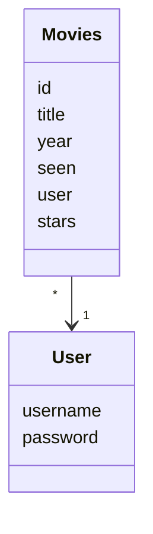
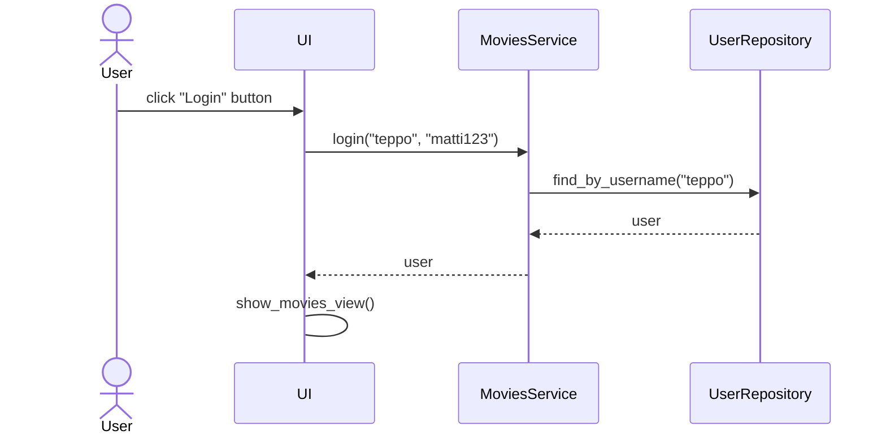

# Arkkitehtuurikuvaus

## Rakenne
Ohjelman rakenne noudattaa kolmitasoista kerrosarkkitehtuuria. Koodin pakkausrakenne on seuraavanlainen:


Pakkaus _ui_ sisältää käyttöliittymästä, _services_ sovelluslogiikasta ja _repositories_ tietojen tallennuksesta vastaavan koodin. Pakkaus _entities_ sisältää luokkia, jotka kuvastavat sovelluksen käyttämiä tietokohteita.

## Käyttöliittymä
Käyttöliittymässä on kolme erilaista näkymää:
- Kirjautuminen
- Uuden käyttäjän luominen
- Lista elokuvista

Eri näkymät ovat toteutettu omina luokkinaan. Näkymistä yksi on aina kerrallaan näkyvänä. [UI](../sc/ui/ui.py)-luokka vastaa näkymien näyttämisestä. Käyttöliittymä ja sovelluslogiikka on pyritty pitämään erillään toisistaan.

Kun sovelluksessa muuttuu tilanne elokuvien listauksessa, eli käyttäjä kirjautuu sisään, elokuvia arvioidaan tai luodaan, kutsutaan metodia [initialize_movie_list](https://github.com/onnanna/ot-harjoitustyo/blob/main/src/ui/movies_view.py#L173), joka renderöi listan elokuvista uudelleen sen perusteella, mitä tietoja se saa sovelluslogiikalta. 

## Sovelluslogiikka
Sovelluksen loogista tietomallia muodostavat luokat [User](https://github.com/onnanna/ot-harjoitustyo/blob/main/src/entities/user.py) ja [Movie](https://github.com/onnanna/ot-harjoitustyo/blob/main/src/entities/movies.py), jotka kuvaavat käyttäjiä ja käyttäjien elokuvia:


Sovelluslogiikan toiminnallisista kokonaisuuksista vastaa luokka [MoviesService](https://github.com/onnanna/ot-harjoitustyo/blob/main/src/services/movies_service.py). Luokassa on käyttöliittymän toiminnoille omat metodit. Metodeja ovat esimerkiksi:
- `login(username, password)`
- `create_movie(title, year, genre, notes)`
- `get_unseen_movies()`
- `set_stars_for_movie(movie_id, stars)`

_MoviesService_ pystyy käsittelemään käyttäjien ja elokuvan tietojen tallennuksesta vastaavan pakkauksessa _repositories_ sijaitsevien luokkien [MoviesRepository](https://github.com/onnanna/ot-harjoitustyo/blob/main/src/repositories/movies_repository.py) ja [UserRepository](https://github.com/onnanna/ot-harjoitustyo/blob/main/src/repositories/user_repository.py) kautta.

`MoviesService`-luokan ja ohjelman muiden osien suhdetta kuvaava luokka/pakkauskaavio:


## Tietojen pysyväistallennus

Pakkauksen _repositories_ luokat `MoviesRepository` ja `UserRepository` pitävät huolen tietojen tallettamisesta. `MoviesRepository` tallentaa tiedot CSV-tiedostoon ja `UserRepository` tallentaa tiedot SQLite-tietokantaan

### Tiedostot
Sovellus tallettaa käyttäjien ja lisättyjen elokuvien tiedot erillisiin tiedostoihin.

Sovellus tallettaa elokuvat CSV-tiedostoon seuraavassa muodossa:
```
613ccade-b7b8-4fc4-9e85-762aaa06f2ee;The Devil Wears Prada 2;2026;0;teppo;0;Comedy;also drama
```
Eli elokuvan id, nimi, julkaisuvuosi, onko elokuva nähty -status (0 = ei nähty, 1 = on nähty), käyttäjän käyttäjätunnus, elokuvalle annettu määrä tähtiä, elokuvan genre ja muistiinpanot. Eri kenttien arvot eroitetaan puolipisteellä.

Käyttäjät tallennetaan SQLite-tietokantaan tauluun nimeltä `users` ja se alustetaan [initialize_database.py](https://github.com/onnanna/ot-harjoitustyo/blob/main/src/initialize_database.py)-tiedostossa.

## Toiminnallisuudet
Kuvataan sovelluksen toimintalogiikkaa sekvenssikaaviona.
### Käyttäjän kirjautuminen sisään
Kun kirjautumisnäkymään syötekenttiin kirjoitetaan olemassa olevat käyttäjätunnus ja salasana, jonka jälkeen klikataan painiketta _Login_ sovelluksen kontrolli etenee seuraavanlaisesti:

