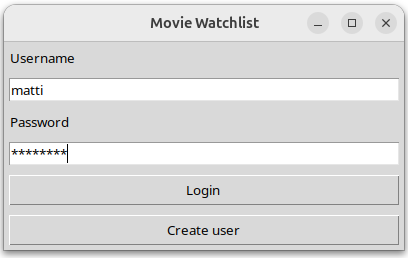
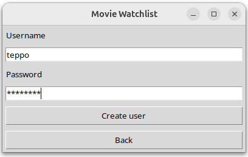
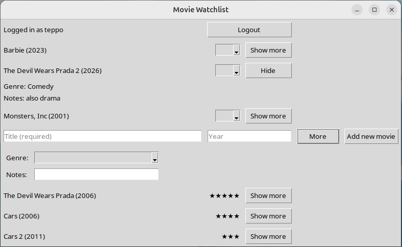

# Käyttöohje

Lataa projektin viimeisimmän releasen lähdekoodi valitsemalla _Assets_ osion alta _Source code_.

## Konfigurointi

Tallennukseen käytettävät tiedostot luodaan automaattisesti _data_ hakemistoon, jos ne eivät siellä vielä ole. Tiedoston muoto on:
```
MOVIES_FILE_NAME=movies.csv
DATABASE_FILENAME=database.sqlite
```

## Ohjelman käynnistäminen
Ennen ohjelman käynnistämistä, asenna riippuvuudet:
```bash
poetry install
```
Suorita alustustoimenpiteet komennolla:
```bash
poetry run invoke build
```
Ohjelman voi käynnistää komennolla:
```bash
poetry run invoke start
```

## Kirjautuminen
Kun sovellus käynnistyy, se avautuu kirjautumisnäkymään:



Sisäänkirjautumaan pääsee kirjoittamalla olemassaoleva käyttäjätunnus ja salasana syötekenttiin ja painamalla "Login" painiketta.

## Uuden käyttäjän luominen

Kirjautumisnäkymästä voi siirtyä uuden käyttäjän luomisnäkymään "Create user" painikkeella.

Uusi käyttäjä luodaan syöttämällä käyttäjätunnus ja salasana syötekenttiin ja painamalla "Create user" painiketta:



Jos uuden käyttäjän luominen onnistuu, siirrytään näkymään, joka listaa nähdyt ja näkemättömät elokuvat.

## Elokuvien luominen ja arvostelu

Kun kirjautuminen onnistuu, siirrytään näkymään, josta löytyy lisätyt elokuvat:



Näkymässä käyttäjä voi lisätä uusia elokuvia, ensimmäiseen syötekenttään elokuvan nimi ja toiseen voi halutessaan laittaa vuoden.
"More" painikkeella avautuu mahdollisuus lisätä elokuvalle genre ja kirjoittaa ylös muita tietoja. 
Elokuvan voi arvostella valitsemalla pudotusvalikosta 1-5 tähteä. Arvostelun jälkeen elokuva putoaa arvosteltujen elokuvien joukkoon.
Lisätiedot elokuvasta näkee painamalla "Show more" ja tiedot voi piilottaa "Hide" nappulasta.

Näkymän painikkeella "Logout" käyttäjä kirjautuu ulos sovelluksesta ja sovellus palaa takaisin kirjautumisnäkymään. 
