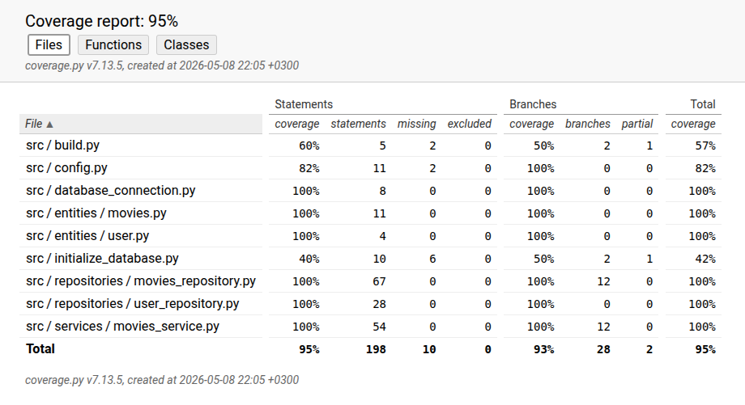

# Testausdokumentti

Sovellusta on testattu automatisoiduilla yksikkö- ja integraatiotesteillä unittestilla ja manuaalisesti testattu järjestelmätasoa.

## Yksikkö- ja integraatiotestaus

### Sovelluslogiikka
Sovelluslogiikkaa testataan [TestMovieService](https://github.com/onnanna/ot-harjoitustyo/blob/main/src/tests/movies_service_test.py)-testiluokalla. Testissä on mukana luokat `FakeMovieRepository` ja `FakeUserRepository`, jotka tallentavat tietoa muistiin.

### Repositiot

`MoviesRepository`-luokkaa testataan testiluokalla [TestMoviesRepository](https://github.com/onnanna/ot-harjoitustyo/blob/main/src/tests/movies_repository_test.py) ja `UserRepository`-luokkaa testataan testiluokalla [TestUserRepository](https://github.com/onnanna/ot-harjoitustyo/blob/main/src/tests/user_repository_test.py)

### Testikattavuus
Sovelluksen testauksen haaraumakattavuus on 93% lukuunottamatta käyttöliittymäkerrosta.

## Järjestelmätestaus

Sovelluksen järjestelmätestausta on suoritettu manuaalisesti.

### Asennus ja konfigurointi

Sovellus on ladattu ja testattu [käyttöohjeen](https://github.com/onnanna/ot-harjoitustyo/blob/main/dokumentaatio/kayttoohje.md) kuvaamalla tavalla Linux-ympäristössä.

### Toiminnallisuudet

[Määrittelydokumentin](https://github.com/onnanna/ot-harjoitustyo/blob/main/dokumentaatio/vaatimusmaarittely.md) ja käyttöohjeen listaamia toiminnallisuuksia on käyty läpi. Toiminnallisuuksien lisäksi syötekenttiä on yritetty täyttää myös virheellisillä arvoilla.
