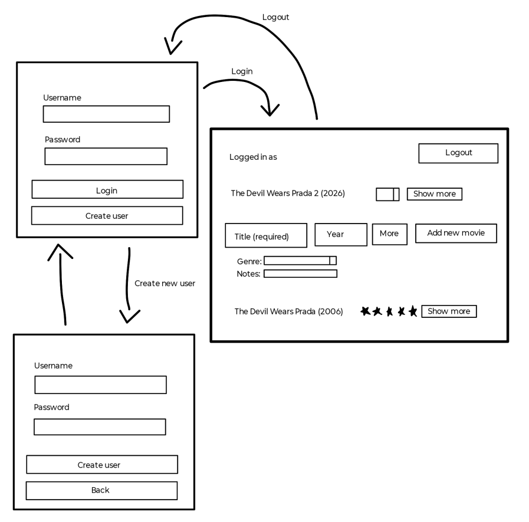

# Vaatimusmäärittely

## Sovelluksen tarkoitus

Sovelluksen avulla käyttäjät voivat listata elokuvia, joita he suunnittelevat katsovansa. Katsotun elokuvan voi arvioida antamalla sille haluamansa määrän tähtiä ja samalla elokuva siirtyy katsottujen elokuvien listalle. Sovellusta voi käyttää useampi rekisteröitynyt käyttäjä, joilla kaikilla ovat omat elokuvalistansa. 

## Käyttäjät
Aluksi sovelluksella on yksi käyttäjärooli, _normaalikäyttäjä_. Myöhemmin sovellukseen voidaan lisätä toinen käyttäjärooli, _pääkäyttäjä_, jolla on suuremmat oikeudet. 

## Käyttöliittymäluonnos

Sovelluksessa on kolme eri näkymää. Sovellus aukeaa sisäänkirjautumisnäkymään, josta voi siirtyä uuden käyttäjän luomisnäkymään tai kirjautua olemassaolevilla tunnuksilla elokuvat listaavaan näkymään.

## Perusversion tarjoama toiminnallisuus

### Ennen kirjautumista
-  Käyttäjä voi luoda käyttäjätunnuksen järjestelmään
    -  Käyttäjätunnuksen täytyy olla uniikki ja vähintään 3 merkkiä pitkä
    -  Salasanan täytyy olla vähintään 5 merkkiä pitkä
-  Käyttäjä voi kirjautua järjestelmään
    -  Kirjautuminen onnistuu, jos syötetään olemassaoleva käyttäjätunnus ja siihen sopiva salasana
    -  Jos käyttäjää ei ole olemassa, salasana ei ole oikein tai käyttäjätunnus ei ole oikein, järjestelmä ilmoittaa tästä

### Kirjautumisen jälkeen
-  Käyttäjä näkee luomansa listan elokuvista
-  Käyttäjä voi lisätä listalle elokuvan
-  Käyttäjä voi arvioida katsomansa listalla olevan elokuvan, jolloin elokuva siirtyy katsottujen elokuvien listalle
-  Käyttäjä voi kirjautua ulos järjestelmästä
-  Käyttäjä voi lisätä elokuvalle genren ja kirjoittaa elokuvan lisäämisvaiheessa muistiinpanoja ylös

## Jatkokehitysideoita

Perusversion jälkeen järjestelmää voidaan täydennetää esim. seuraavanlaisilla ominaisuuksilla:

- Useampien elokuvalistojen luonti esim. genreittäin
- Elokuvan tietojen muokkaaminen
- Elokuvien järjestely arvostelujen mukaan
- Listojen muuttaminen julkisiksi (näkyy muille käyttäjille) tai listan pitäminen yksityisenä
- Käyttäjätunnuksen poistaminen
- Listojen poistaminen
- Mahdollisuus järjestellä elokuvia esim. katsomispäivän tai -vuoden mukaan
