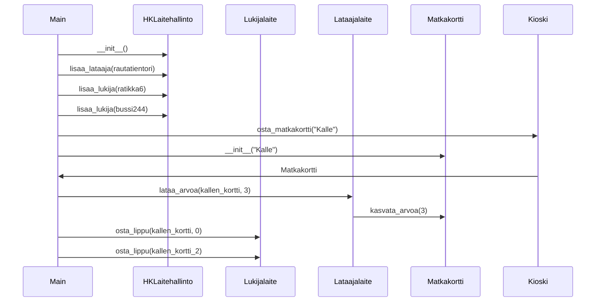

```mermaid
    sequenceDiagram
        participant Main
        participant HKLaitehallinto
        participant Lukijalaite
        participant Lataajalaite
        participant Matkakortti
        participant Kioski

        Main->>HKLaitehallinto: __init__()
        
        Main->>HKLaitehallinto: lisaa_lataaja(rautatientori)
        Main->>HKLaitehallinto: lisaa_lukija(ratikka6)
        Main->>HKLaitehallinto: lisaa_lukija(bussi244)

        Main->>Kioski: osta_matkakortti("Kalle")
        Main->>Matkakortti: __init__("Kalle")
        Kioski->>Main: Matkakortti

        Main->> Lataajalaite: lataa_arvoa(kallen_kortti, 3)
        Lataajalaite->>Matkakortti: kasvata_arvoa(3)

        Main->>Lukijalaite: osta_lippu(kallen_kortti, 0)

        Main->>Lukijalaite: osta_lippu(kallen_kortti_2)
        
```